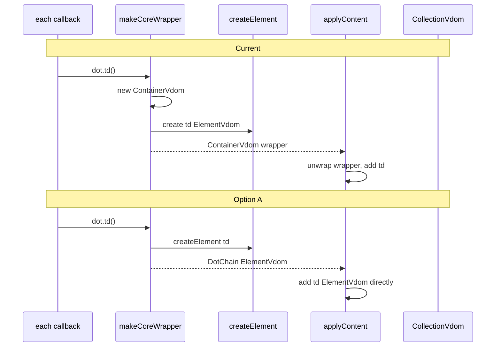

# Option A: Direct `ElementVdom` Returns with Lazy Fragment Promotion

## Summary

Replace the current `makeCoreWrapper` behavior — which allocates a full `ContainerVdom` for every standalone `dot.tag()` call — with a path that returns **`ElementVdom` directly** for single-element builds. Sibling chaining (`dot.div().p().p()`) is preserved by **lazy promotion** to a lightweight **`FragmentVdom`** only when a second chained tag call occurs.

This is a **global change to the core `dot.*` API** (`makeCoreWrapper`), not a special case for `dot.each`.

---

## Problem Statement

### Current behavior

`makeCoreWrapper` in `src/dot.ts` implements standalone calls like `dot.tr(...)`, `dot.p(...)`, `dot.td(...)`:

```typescript
const makeCoreWrapper = (d, fn) => {
  d[fn] = function () {
    let n = new ContainerVdom(dot);
    n[fn](...arguments);
    return n;
  };
};
```

Each call:

1. Allocates a **`ContainerVdom`** (full document builder with `_dot`, `when`, `each`, `mount`, live-render `_parent` logic, etc.).
2. Delegates to `ContainerVdom.prototype[tag]`, which creates the real **`ElementVdom`** and stores it in `_children`.
3. Returns the **wrapper**, not the element.

### Costs

| Scenario | Cost |
|----------|------|
| Nested-args (`dot.tr(dot.td(), dot.td())`) | One throwaway `ContainerVdom` per nested `dot.*` call; unwrapped via `applyContent`, then GC'd |
| Single-element return (`dot.p("x")`, root of `dot.each` row) | Wrapper becomes the list item VDOM root → extra `ContainerVdom._render` hop per item |
| Sibling chain (`dot.div().p().p()`) | Wrapper intentionally holds multiple root elements |

Profiling shows **`d.<computed>` (`makeCoreWrapper`)** and **wrapper `_render`** as top self/total time contributors during bulk list create/append. The list diff algorithm (`CollectionVdom.updateList`) is not the bottleneck.

### What is NOT the problem

- `dot(document.body).div(...)` — uses the **attached** `ContainerVdom` on a real DOM node; does not go through `makeCoreWrapper`. Unchanged.
- `ContainerVdom` on elements with `_parent` and live rendering — unchanged.

---

## Goals

1. **Eliminate ephemeral `ContainerVdom` allocation** for single-element standalone `dot.tag()` calls (majority case, including `dot.each` row builders using nested args).
2. **Preserve existing semantics** for sibling chaining: `dot.div().p("a").p("b")` produces sibling nodes, not nested.
3. **No public API change** — same call patterns, same HTML output.
4. **Backward compatible** with existing tests and patterns where possible.

## Non-goals

- Compiled templates / static hoisting (Vue/Svelte model).
- Changing attached-container rendering (`dot("#app").div(...)`).
- Removing per-row `ElementVdom` construction, attribute binding, or event listener setup.

---

## Proposed Architecture

### New types

#### 1. `FragmentVdom` (new class, extends `Vdom`)

A minimal multi-root container for sibling chains. Intentionally **not** a full `ContainerVdom`.

```typescript
class FragmentVdom extends Vdom {
  _children: Vdom[] = [];

  _render(target: HTMLElement): void;
  _unrender(): void;
  _getNodes(): Node[];  // flatten children’s nodes in order
}
```

**Includes:**

- `_children` array
- Tag methods (`div`, `p`, `tr`, …) that create elements via shared `createElement()` and `_addChild` (returns `this` for chaining)
- `_render` / `_unrender` / `_getNodes` by iterating children (same pattern as `ContainerVdom._render`, without `_parent` live-render side effects)

**Excludes:**

- `_dot`-scoped features: `when`, `each`, `mount`, `html`, `text`, `on`, etc.
- `_parent` / immediate render on `_addChild`

#### 2. `DotChain` (facade / handle, not necessarily a `Vdom` subclass)

Returned from `makeCoreWrapper` tag functions. Wraps either:

- a single **`ElementVdom`** (before promotion), or
- a **`FragmentVdom`** (after promotion)

Responsible for:

- Exposing all tag methods for chaining (`.p()`, `.div()`, …)
- Implementing lazy promotion (see below)
- Delegating `_render`, `_unrender`, `_getNodes`, `toString` to the inner root (`ElementVdom` or `FragmentVdom`)
- Being treated as **`Vdom`** wherever the callback return value or content is consumed (either implement `Vdom` interface on the handle, or unwrap to inner root at consumption boundaries)

**Design choice to resolve during implementation:**

- **A1:** `DotChain extends Vdom` and delegates all abstract methods.
- **A2:** `makeCoreWrapper` returns `ElementVdom | FragmentVdom` directly; chaining mutates/wraps in place (no separate handle type).

Recommendation: **A1 (`DotChain` delegating wrapper)** — keeps promotion logic localized and avoids putting chain methods on `ElementVdom` itself.

---

### Shared factory: `createElement(tag, args)`

Extract element construction from `ContainerVdom.prototype[tag]` into a shared function in `dot.ts`:

```typescript
function createElement(tag: string, args: unknown[]): ElementVdom {
  const n = new ElementVdom(dot, tag);
  for (const arg of args) {
    if (isContent(arg)) applyContent(n, arg);
    else if (arg && typeof arg === "object") applyAttributes(n, arg);
  }
  return n;
}
```

`ContainerVdom.prototype[tag]` on **attached** containers refactors to call `createElement` + `this._addChild(n)`.

---

### Lazy promotion algorithm

**Initial call** — `dot.div(...)` via `makeCoreWrapper`:

```
1. el = createElement("div", args)
2. return new DotChain(el)   // wraps single ElementVdom
```

**Chained call** — `dot.div().p("a")`:

```
1. DotChain receives .p("a")
2. If inner is ElementVdom:
     a. frag = new FragmentVdom()
     b. frag._children.push(inner ElementVdom)
     c. createElement("p", args) → add to frag
     d. inner = frag; return DotChain(frag)
3. If inner is already FragmentVdom:
     a. createElement("p", args) → add to frag
     b. return DotChain(frag)
```

**No promotion** when:

- User never chains: `dot.tr(attrs, dot.td(), dot.td())` — only the outer `dot.tr` returns `DotChain` wrapping one `ElementVdom`; inner `dot.td()` calls also return single elements consumed via `applyContent`.
- User passes everything as nested args: `dot.div(dot.p(), dot.p())` — each call is independent, no sibling wrapper needed.

**Optional optimization (Phase 1.1):** If a `DotChain` wrapping a single `ElementVdom` is never promoted and is passed to `applyContent` or returned from `dot.each`, unwrap to bare `ElementVdom` at consumption time to skip delegate indirection. Not required for correctness.

---

## Call pattern matrix

| Pattern | Today | After Option A |
|---------|-------|----------------|
| `dot.p("hello")` | `ContainerVdom` → `[p]` | `DotChain` → `ElementVdom(p)` |
| `dot.tr(dot.td(), dot.td())` | 3× `ContainerVdom` | 3× `ElementVdom` (via `DotChain` unwrapped or direct) |
| `dot.div().p().p()` | 1× `ContainerVdom` → `[div, p, p]` | 1× `FragmentVdom` → `[div, p, p]` |
| `dot(document.body).div()` | attached `ContainerVdom` | unchanged |
| `dot.each(arr, x => dot.tr(...))` | row root = `ContainerVdom` → `tr` | row root = `ElementVdom(tr)` |
| `dot.when(true, dot.p("x"))` | `then instanceof ContainerVdom` | must accept `DotChain` / `ElementVdom` |

---

## Integration points (must update)

### 1. `isContent()` in `dot.ts`

Currently:

```typescript
return arg instanceof ContainerVdom || arg instanceof Vdom || ...
```

Add: `FragmentVdom`, and/or treat `DotChain` as content (unwrap to inner Vdom).

### 2. `applyContent()` in `dot.ts`

Currently unwraps `ContainerVdom`:

```typescript
else if (cont instanceof ContainerVdom) {
  for (let i = 0; i < cont._children.length; i++)
    n.children._addChild(cont._children[i]);
}
```

Add parallel branch for `FragmentVdom` (same unwrap loop).

For `DotChain`: unwrap to inner `ElementVdom` or promote `FragmentVdom` children.

For bare `ElementVdom` passed as content: already handled by `cont instanceof Vdom`.

### 3. `ContainerVdom.when()` / `otherwiseWhen()`

Currently:

```typescript
if (then instanceof ContainerVdom) {
  thenContainer = then;
} else {
  thenContainer = new ContainerVdom(this._dot);
  thenContainer._addChild(new TextVdom(...));
}
```

Generalize to accept **`DotChain`**, **`ElementVdom`**, **`FragmentVdom`**:

- `FragmentVdom` / multi-child → wrap or use directly as `thenContainer` equivalent
- Single `ElementVdom` → wrap in `ContainerVdom` or new lightweight adapter for conditional branch
- `DotChain` → unwrap then same logic

Alternatively introduce shared helper:

```typescript
function asContainerChildren(dot, value): Vdom[]
```

### 4. `CollectionVdom` render callback return

Today:

```typescript
const vdom = vdomOrContent instanceof Vdom ? vdomOrContent : new TextVdom(...);
```

Ensure `DotChain` is `instanceof Vdom` or unwrap before storage. List items should ideally store **`ElementVdom`** or **`FragmentVdom`**, not a deep wrapper stack.

### 5. `toString()` (used in unit tests)

`Vdom.toString()` calls `_render` on a temp div. `DotChain` must delegate. Confirm:

- `dot.p("x").toString()` still works
- `dot.div().p().p().toString()` still works via `FragmentVdom`

---

## Tag method registration

Today tag methods are installed on:

1. `ContainerVdom.prototype[tag]` — attached builders
2. `makeCoreWrapper(_dot, tag)` — standalone builders

After Option A:

1. **`ContainerVdom.prototype[tag]`** — calls `createElement` + `this._addChild(el)`; returns `this` (unchanged chaining on attached containers).
2. **`makeCoreWrapper`** — calls `createElement` + wraps in `DotChain`; chained calls go through `DotChain.prototype[tag]`.
3. **`FragmentVdom.prototype[tag]`** — for chaining after promotion; same as current container tag logic but adds to fragment and returns `this`.
4. **`DotChain.prototype[tag]`** — promotion + delegate.

All tag names come from existing `allTags` array in `dot.ts`. Special wrappers (`each`, `text`, `html`, `mount`, `when`, `on`) remain on `ContainerVdom` / `makeCoreWrapper` as today.

---

## Rendering semantics

### Single `ElementVdom` list item (primary win)

**Before:** `CollectionVdom` item vdom = `ContainerVdom` → `_render` loops one child → `ElementVdom(tr)._render`.

**After:** item vdom = `ElementVdom(tr)` → `_render` directly.

Saves one `ContainerVdom._render` and one allocation per list row.

### Nested standalone calls

**Before:** `dot.td()` → wrapper → unwrap in `applyContent`.

**After:** `dot.td()` → `ElementVdom` → `_addChild` directly.

Saves one allocation per nested call (~7–8 per benchmark row).

### Sibling chains

**Before:** ephemeral `ContainerVdom` with N children.

**After:** `FragmentVdom` with N children — slimmer object, no `_dot` document-builder features, no `_parent` render path.

---

## Performance expectations

Based on profiling (~23ms create 1000, ~28ms append 1000):

| Component | Expected change |
|-----------|-----------------|
| `makeCoreWrapper` / `d.<computed>` self time | **Large decrease** |
| `ContainerVdom._render` total time | **Decrease** (fewer wrapper hops) |
| `ElementVdom._render` | Similar or slightly higher (more direct calls, less hidden in wrapper) |
| `createElement`, `applyAttributes`, events | Unchanged |
| `CollectionVdom.updateList` | Unchanged (orchestration only) |

**Overall estimate:** ~15–25% faster on bulk nested-args list operations. Not a order-of-magnitude change — row construction and DOM creation remain.

---

## Risks and edge cases

| Risk | Mitigation |
|------|------------|
| `instanceof ContainerVdom` checks miss new return types | Audit all `ContainerVdom` / `Vdom` checks; add `FragmentVdom` / unwrap `DotChain` |
| `when(true, dot.p("x"))` breaks | Extend `when` branch to accept `ElementVdom` / `DotChain` |
| Chaining on promoted vs un promoted inconsistent | Centralize in `DotChain`; exhaustive tests for `dot.div().p().div()` |
| `DotChain` stored in collection causes move/reuse bugs | Unwrap to inner `Vdom` when storing in `CollectionVdom.mappedItems` |
| Re-entrancy (callback calls `dot.each` inside `dot.each`) | Promotion state is per-call stack, not global |
| TypeScript public API types for `dot.*` return type | Today likely `ContainerVdom`; may become `DotChain` or union; consider interface `IDotBuildResult` |
| `ComponentVdom.build()` returning `dot.div()` | Same as any standalone call — should benefit automatically |

---

## Testing requirements

### Must pass (regression)

- `unittests-v2/api/02.flow.test.ts` — especially sibling chain tests:
  - `dot.div().p("a, 0").p("b, 1").p("c, 2").div()`
  - inline `each` patterns
- `unittests-v2/api/34.collection-append-optimizations.test.ts`
- `unittests-v2/api/35.collection-fragment-batching.test.ts`
- `unittests-v2/api/09.keyed-diffing.test.ts`
- Conditional tests using `dot.when(true, dot.p("yes"))`

### New tests

- `dot.tr(dot.td(), dot.td())` returns unwrapable tree without `ContainerVdom` in middle (internal assertion or structure test)
- `dot.div().p()` promotion: first call single element, second call fragment with 2 children
- `dot.p("x")` alone: `_getNodes()` length === 1, no wrapper
- `toString()` parity before/after for chain and nested patterns

### Profiling validation

Re-run `#/profiling` Create 1,000 and Append 1,000; expect `d.<computed>` and wrapper `_render` to drop in bottom-up view.

---

## Implementation phases

### Phase 1 (MVP)

1. Add `createElement()` shared factory.
2. Add `FragmentVdom`.
3. Add `DotChain` with lazy promotion.
4. Replace `makeCoreWrapper` body.
5. Update `isContent`, `applyContent`, `when`/`otherwiseWhen`.
6. Unwrap `DotChain` in `CollectionVdom` when storing item vdom.
7. Run full unit test suite + profiling comparison.

### Phase 1.1 (optional polish)

- Unwrap single-element `DotChain` at `applyContent` boundaries (skip delegate).
- Pool/reuse `FragmentVdom` for hot paths (only if profiling shows alloc still matters).

### Explicitly out of scope

- Changing `ContainerVdom` on attached DOM targets.
- Event delegation or lazy listener attachment.
- Compiler/template layer.

---

## Alternative considered: global `ElementVdom` only (breaking)

Return `ElementVdom` from `makeCoreWrapper` with **no** fragment promotion; require `dot.div(dot.p(), dot.p())` instead of `dot.div().p().p()`.

**Rejected** because sibling chaining is part of the public API and covered by tests. Lazy promotion achieves the same perf for the common case without breaking chains.

---

## Evaluation criteria (for independent review)

1. **Correctness:** Do all existing unit tests pass without output changes?
2. **Coverage:** Are all `instanceof ContainerVdom` content/conditional paths updated?
3. **Performance:** Does `d.<computed>` self time drop ≥10% on create/append profiles?
4. **Complexity:** Is `DotChain` + `FragmentVdom` justified vs a lighter always-fragment approach (Option B)?
5. **Maintainability:** Does `createElement` duplication stay single-source between attached and standalone paths?
6. **Type safety:** Are `dot.*` return types accurately reflected for IDE consumers?

---

## Reference: current vs proposed flow (nested-args row)



This document is self-contained for independent evaluation; no code changes are implied until approved and implemented.